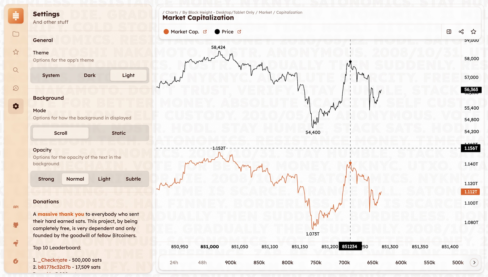
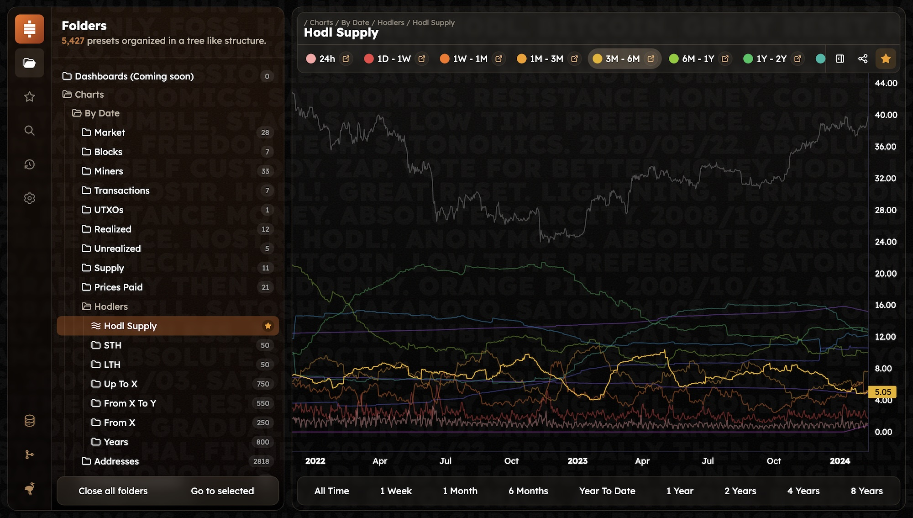
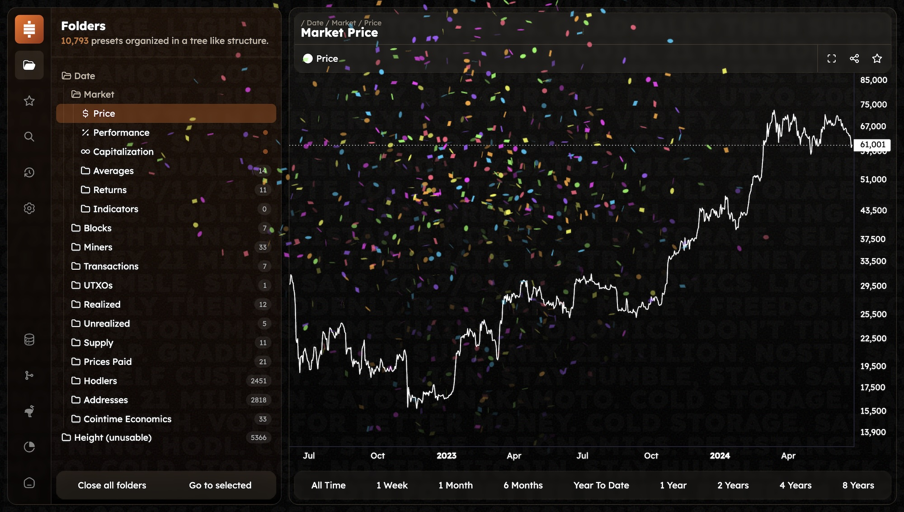

# Changelog

## v. 0.2.0 | 851286 - 2024/07/08

### App

- General
  - Added height datasets and many optimizations to make them usable but only available on desktop and tablets for now
  - Added a light theme
- Charts
  - Added split panes in order to have the vertical axis visible for all datasets
  - Added min and max values on the charts
  - Fixed legend hovering on mobile not resetting on touch end
  - Added "3 months" and yearly time scale setters (from year 2009 to today)
  - Hide scrollbar of timescale setters and instead added scroll buttons to the legend only visible on desktop
  - Improved Share/QR Code screen
  - Changed all Area series to Line series
  - Fixed horizontal scrollable legend not updating on preset change
- Performance
  - Improved app's reactivity
  - Added some chunk splitting for a faster initial load
  - Global improvements that increased the Lighthouse's performance score
- Settings
  - Finally made a proper component where you can chose the app's theme, between a moving or static background and its text opacity
  - Added donations section with a leaderboard
  - Added various links that are visible on the bottom side of the strip on desktop to mobile users
  - Added install instructions when not installed for Apple users
- Misc
  - Support mini window size, could be useful for embedded views
  - Hopefully made scrollbars a little more subtle on WIndows and Linux, can't test
  - Generale style updates

### Parser

- Fixed ulimit only being run in Mac OS instead of whenever the program is detected

## v. 0.1.1 | 849240 - 2024/06/24

### Parser

- Fixed overflow in `Price` struct which caused many Realized Caps and Realized Prices to have completely bogus data
- Fixed Realized Cap computation which was using rounded prices instead normal ones

### Server

- Added the chunk, date and time of the request to the terminal logs

### App

- Chart
  - Added double click option on a legend to toggle the visibility of all other series
  - Added highlight effect to a legend by darkening the color of all the other series on the chart while hovering it with the mouse
  - Added an API link in the legend for each dataset where applicable (when isn't generated locally)
  - Save fullscreen preference in local storage and url
  - Improved resize bar on desktop
  - Changed resize button logo
  - Changed the share button to visible on small screen too
  - Improved share screen
  - Fixed time range shifting not being the one in url params or saved in local storage
  - Fixed time range shifting on series toggling via the legend
  - Fixed time range shifting on fullscreen
  - Fixed time range shifting on resize of the sidebar
  - Set default view at first load to last 6 months
  - Added some padding around the datasets (year 1970 to 2100)
- History
  - Changed background for the sticky dates from blur to a solid color as it didn't appear properly in Firefox
- Build
  - Tried to add lazy loads to have split chunks after build, to have much faster load times and they worked great ! But they completely broke Safari on iOS, we can't have nice things
  - Removed many libraries and did some things manually instead to improve build size
- Strip
  - Temporarily removed the Home button on the strip bar on desktop as there is no landing page yet
- Settings
  - Added version
- PWA
  - Fixed background update
  - Changed update check frequency to 1 minute (~1kb to fetch every minute which is very reasonable)
  - Added a nice banner to ask the user to install the update
- Misc
  - Removed tracker even though it was a very privacy friendly as it appeared to not be working properly

### Price

- Deleted old price datasets and their backups

## v. 0.1.0 | 848642 - 2024/06/19

