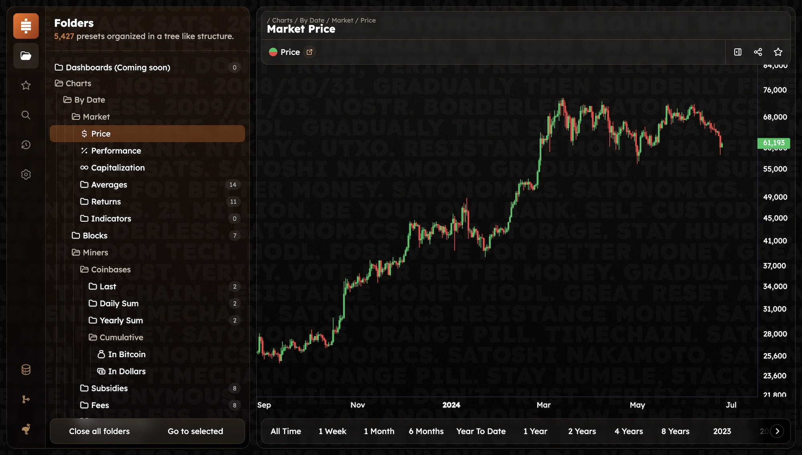

# SATONOMICS

## Description

Satonomics is a Bitcoin only on-chain data generator and visualizer that is fully free, open source, verifiable, local-first and self-hostable.

While [mempool.space](https://mempool.space) gives a very micro view of the network where you can follow the journey of any sats, this tool is the exact opposite and very complimentary by giving you a much more global/macro view of the flow and various dynamics of the network.

To promote even more transparency and trust in the network, this project is committed to making on-chain data accessible and verifiable to all, no matter their situation or intentions. This is why, the whole project is completely free, from code to services, including a real-time API with thousands and thousands routes which can be used at will.

**Having anyone be able to do a healthcheck of the network is incredibly important and should be wanted by everyone.**

## Warning

This project is in a very early stage, expect this to break and the data the be false.

## Instances

Web App:
- [app.satonomics.xyz](https://app.satonomics.xyz)

API:
- [api.satonomics.xyz](https://api.satonomics.xyz)

## Structure

- `parser`: The backbone of the project, it does most of the work by parsing and then computing datasets from the timechain.
- `server`: A small server which automatically creates routes to access through an API all created datasets.
- `app`: A web app which displays the generated datasets in various charts.

## Git

- [Repository](https://codeberg.org/satonomics/satonomics)
- [Issues](https://gitworkshop.dev/r/naddr1qq99xct5dahx7mtfvdesz9thwden5te0wp6hyurvv4ex2mrp0yhxxmmdqgsfw5dacngjlahye34krvgz7u0yghhjgk7gxzl5ptm9v6n2y3sn03srqsqqqaueek2h03/issues)
- [Proposals](https://gitworkshop.dev/r/naddr1qq99xct5dahx7mtfvdesz9thwden5te0wp6hyurvv4ex2mrp0yhxxmmdqgsfw5dacngjlahye34krvgz7u0yghhjgk7gxzl5ptm9v6n2y3sn03srqsqqqaueek2h03/proposals)

## Goals

- Be the absolute best on-chain data source and app
- Have as many datasets and charts as possible
- Be self-hostable on cheap computers
  - Be runnable on a machine with 8 GB RAM (16 GB RAM is already possible right now)
- Still being runnable 10 years from now
  - By not relying on any third-party dependencies besides price APIs (which are and should be very common and easy to update)
  - By **NOT** doing address labelling/tagging (which means **NO** exchange or any other individual address tracking), for that please use [mempool.space](https://mempool.space) or any other tool

## Proof of Work

Aka: Previous iterations

The initial idea was totally different yet morphed over time into what it is today: a fully FOSS self-hostable on-chain data generator

- https://github.com/drgarlic/satonomics
- https://github.com/drgarlic/satonomics-parser
- https://github.com/drgarlic/satonomics-explorer
- https://github.com/drgarlic/satonomics-server
- https://github.com/drgarlic/satonomics-app
- https://github.com/drgarlic/bitalisys
- https://github.com/drgarlic/bitesque-app
- https://github.com/drgarlic/bitesque-back
- https://github.com/drgarlic/bitesque-front
- https://github.com/drgarlic/bitesque-assets
- https://github.com/drgarlic/syf
